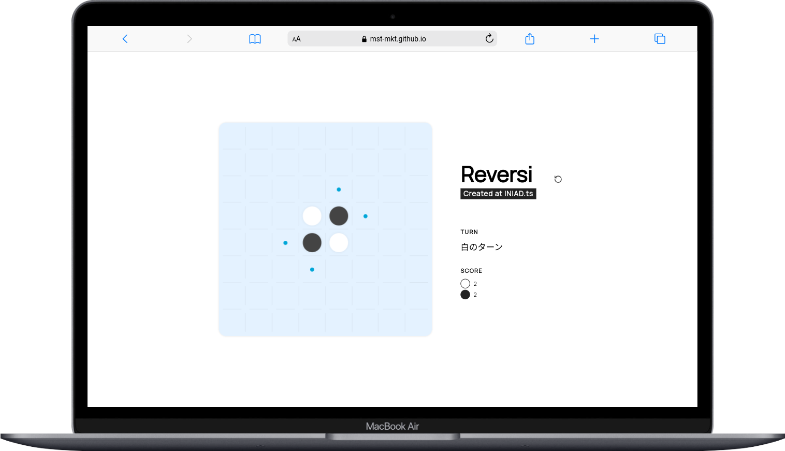

#  Reversi

[](https://github.com/mst-mkt/reversi/actions/workflows/test.yml)
[](https://github.com/mst-mkt/reversi/actions/workflows/deploy-client.yml)



## Play

Available on GitHub Pages: \
https://mst-mkt.github.io/reversi/

## Development

### Install Dependencies

```sh
npm install
```

### Run Development Server

```sh
npm run dev
```

## Others

- The implementation of react state is minimized as much as possible.
- The complexity (eslint criteria) of the implementation is kept as small as possible.
